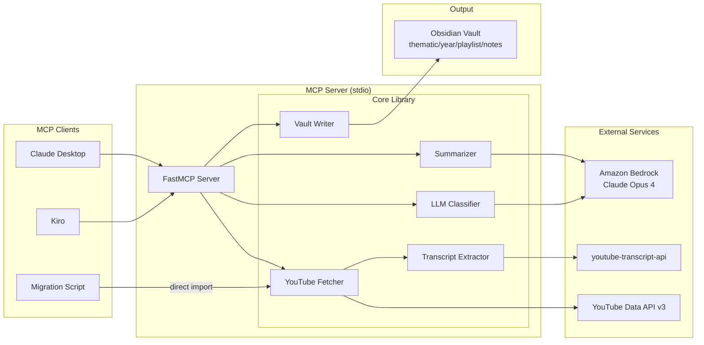

# Detailed Design: youtube-to-vault

## Overview

This project refactors the `aws-events` repository into a clean architecture centered around an **MCP Server** (`youtube-to-vault`) that transforms YouTube videos and playlists into structured Obsidian vault notes with AI-generated summaries. A companion **migration script** bootstraps the vault from the existing `playlists.yaml` data.

The MCP Server is designed for daily use — add a video or playlist from any MCP client (Claude Desktop, Kiro, etc.) and get a fully formatted Obsidian note with frontmatter, tags, wikilinks, and a thematic AI summary.

## Detailed Requirements

### Functional Requirements

1. **FR-1**: MCP Server exposes tools to add individual videos or entire playlists to the vault
2. **FR-2**: Automatic thematic detection from video title/description via LLM classification
3. **FR-3**: Optional `thematic` parameter overrides auto-detection; if detection fails, return candidates
4. **FR-4**: Transcript extraction via `youtube-transcript-api` with language priority matching video language
5. **FR-5**: AI summary generation via Bedrock Claude Opus 4, in the video's language
6. **FR-6**: Summary follows strict formatting rules: active voice, paragraphs, 3 heading levels, formal tone, no bullets
7. **FR-7**: Frontmatter includes: title, description, event, year, clients (list), tags, url, date, language, has_transcript
8. **FR-8**: Wikilinks to client names in note body (`[[TF1]]`)
9. **FR-9**: Auto-generated MOC (Map of Content) per event and root MOC
10. **FR-10**: Dataview query pages pre-configured (by client, by tag, recent)
11. **FR-11**: Idempotent processing — skip existing notes on re-run
12. **FR-12**: Retry with exponential backoff on transient errors (transcript fetch, Bedrock throttling)
13. **FR-13**: If no transcript available, summarize from description; if description insufficient, create note without summary
14. **FR-14**: Migration script reads `playlists.yaml`, processes all media playlists fully, classifies videos in other playlists by title
15. **FR-15**: Vault path configurable via server parameter

### Non-Functional Requirements

1. **NFR-1**: Pipeline processes a single video in < 60s (excluding Bedrock latency)
2. **NFR-2**: Graceful degradation — partial failures don't block other videos
3. **NFR-3**: Cost-aware — classification uses minimal tokens (title+description only)
4. **NFR-4**: No external dependencies beyond YouTube API, youtube-transcript-api, and Bedrock

## Architecture Overview



## Components and Interfaces

### 1. Core Library (`src/youtube_to_vault/core/`)

#### `youtube.py` — YouTube Fetcher
```python
class VideoMetadata:
    video_id: str
    title: str
    description: str
    published_at: str
    channel_title: str
    language: str | None
    playlist_id: str | None
    playlist_title: str | None

def fetch_video_metadata(video_id: str) -> VideoMetadata
def fetch_playlist_videos(playlist_id: str) -> list[VideoMetadata]
```

#### `transcript.py` — Transcript Extractor
```python
@dataclass
class TranscriptResult:
    text: str              # Full concatenated transcript
    language: str          # Detected language code
    is_generated: bool     # Auto-generated or manual
    available: bool        # Whether transcript was found

def fetch_transcript(video_id: str, preferred_languages: list[str] = None) -> TranscriptResult
```

#### `classifier.py` — LLM Classifier
```python
@dataclass
class ClassificationResult:
    thematic: str | None           # Detected thematic (e.g., "media", "ai", "security")
    confidence: float              # 0-1 confidence score
    candidates: list[str]          # Alternative thematics if low confidence
    is_media_client: bool          # Whether video features a media client

def classify_video(metadata: VideoMetadata, existing_thematics: list[str]) -> ClassificationResult
def detect_clients(metadata: VideoMetadata, transcript: str | None) -> list[str]
```

Note: `existing_thematics` is obtained from `VaultWriter.get_existing_thematics()` which scans top-level vault directories. The classifier receives this list as input — it does not query the vault directly.

#### `summarizer.py` — AI Summarizer
```python
def generate_summary(
    transcript: str | None,
    description: str,
    metadata: VideoMetadata,
    language: str
) -> str
```

System prompt encodes the summarization rules:
- Active voice, full sentences, flowing paragraphs
- Markdown with 3 heading levels
- Focus on key decisions, action items, outcomes
- Formal yet engaging tone
- Search AWS documentation for context if needed

#### `vault.py` — Vault Writer
```python
@dataclass
class VaultConfig:
    vault_path: Path
    
class VaultWriter:
    def __init__(self, config: VaultConfig)
    def note_exists(self, video_id: str) -> bool
    def write_note(self, metadata: VideoMetadata, summary: str, clients: list[str], tags: list[str], thematic: str) -> Path
    def update_moc(self, thematic: str, year: int, playlist_title: str) -> None
    def get_existing_thematics(self) -> list[str]
```

#### `pipeline.py` — Orchestrator
```python
@dataclass
class ProcessResult:
    video_id: str
    status: str  # "created", "skipped", "error"
    note_path: Path | None
    error: str | None

def process_video(video_id: str, vault_config: VaultConfig, thematic: str | None = None) -> ProcessResult
def process_playlist(playlist_id: str, vault_config: VaultConfig, thematic: str | None = None) -> list[ProcessResult]
```

### 2. MCP Server (`src/youtube_to_vault/server.py`)

FastMCP server exposing tools:

#### Tool: `add_video`
- **Input**: `url: str` (YouTube URL or video ID), `thematic: str | None`, `vault_path: str | None`
- **Output**: Note path created, or candidates if thematic detection fails
- **Behavior**: Full pipeline — fetch metadata → transcript → classify → summarize → write note

#### Tool: `add_playlist`
- **Input**: `url: str` (YouTube playlist URL or ID), `thematic: str | None`, `vault_path: str | None`
- **Output**: Summary of processed videos (created/skipped/errors)
- **Behavior**: Iterates all videos in playlist, processes each

#### Tool: `list_thematics`
- **Input**: `vault_path: str | None`
- **Output**: List of existing thematic directories in the vault

### 3. Migration Script (`scripts/migrate.py`)

```python
def migrate(config_path: Path, vault_path: Path):
    """
    Reads playlists.yaml, processes playlists:
    - Media playlists (media-symposium, ibc, nab, media-day): process all videos, thematic="media"
    - Other playlists: classify each video title, only process if media client detected
    """
```

Invoked via Taskfile: `task migrate`

## Data Models

### Vault Directory Structure

```
vault/
├── MOC.md                              # Root Map of Content
├── media/
│   ├── 2025/
│   │   ├── media-symposium/
│   │   │   ├── _index.md              # Playlist MOC
│   │   │   ├── nouveautes-aws-medias.md
│   │   │   ├── diffusion-sport-ott.md
│   │   ├── reinvent/
│   │   │   ├── _index.md
│   │   │   ├── media-session-title.md
│   ├── 2024/
│   │   ├── ibc/
│   │   ├── reinvent/
│   │   ├── reinforce/
├── queries/
│   ├── by-client.md
│   ├── by-tag.md
│   └── recent.md
├── templates/
│   └── video-note.md
```

### Note Frontmatter Schema

```yaml
---
title: "Diffusion du sport à grande échelle en OTT"
description: "Prime Video présente son architecture de streaming live..."
event: "media-symposium"
year: 2023
clients:
  - "Prime Video"
  - "Amazon"
tags:
  - streaming
  - live
  - sports
  - ott
url: "https://www.youtube.com/watch?v=TRma3Bw1hUI"
video_id: "TRma3Bw1hUI"
date: 2023-07-27
language: fr
has_transcript: true
thematic: media
playlist: "AWS France Media Day 2023"
---
```

### Note Body Template

```markdown
# {title}

> [!info] Vidéo
> 📺 [Regarder sur YouTube]({url})
> 📅 {date} | 🎤 {event} | 🌐 {language}
> 🏢 Clients: [[Client1]], [[Client2]]

## Résumé

{AI-generated summary with 3 heading levels}
```

## Error Handling

| Error | Strategy |
|-------|----------|
| YouTube API quota exceeded | Stop processing, report progress |
| youtube-transcript-api `IpBlocked` | Exponential backoff (max 3 retries), then skip video |
| youtube-transcript-api `TranscriptsDisabled` / `NoTranscriptFound` | Summarize from description |
| Bedrock `ThrottlingException` | Exponential backoff with jitter (max 5 retries) |
| Bedrock other errors | Log error, skip video, continue |
| Video private/deleted | Skip, log |
| Classification low confidence | Return candidates, don't write note (for MCP); use "media" default (for migration) |

## Testing Strategy

- **Unit tests**: Core library functions with mocked external services
- **Integration tests**: End-to-end pipeline with real YouTube API (small test playlist)
- **MCP tests**: FastMCP test client verifying tool schemas and responses

## Appendices

### Technology Choices

| Component | Choice | Rationale |
|-----------|--------|-----------|
| MCP Framework | FastMCP | Simplest Python MCP server, decorator-based |
| Transport | stdio | Standard for local MCP servers |
| LLM | Bedrock Claude Opus 4 | Best quality for summaries, AWS-native |
| Transcript | youtube-transcript-api | Free, no API key, good language support. YouTube Data API v3 does NOT provide transcript access (captions.download requires OAuth + video ownership). No fallback needed — this is the only viable option for third-party video transcripts. |
| YouTube metadata | Google YouTube Data API v3 | Official, reliable, low quota cost. Used for video metadata (title, description, date) only — not transcripts. |
| Frontmatter | python-frontmatter | Standard lib for parsing/writing YAML frontmatter in markdown files |
| Package manager | uv | Fast, modern Python package management |

### Cost Analysis

| Operation | Cost per video | 500 videos |
|-----------|---------------|------------|
| Classification (title only) | ~$0.004 | ~$2 |
| Summary (full transcript) | ~$0.375 | ~$187 |
| YouTube API | Free (within quota) | Free |
| Transcript | Free | Free |
| **Total** | ~$0.38 | **~$189** |

### Alternative Approaches Considered

1. **CLI-only (no MCP)**: Rejected — doesn't support daily use from AI assistants
2. **Supadata for transcripts**: Rejected — paid, youtube-transcript-api is sufficient
3. **Cheaper model for summaries**: Rejected — user wants maximum quality (Opus 4)
4. **SSE transport**: Rejected — stdio is simpler for local use, no server management
